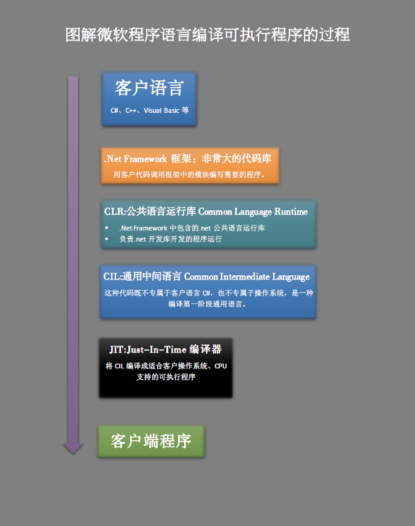

今天我们开始C#语言的学习，我们所采用的书籍如下：

>C#入门经典（第五版）/ （美）沃森 （美）内格尔等著；——北京：清华大学出版社，2010.12

今天主要进度为第一部分C#语言，第一二章，C#简介  编写C#程序

首先我们安装了微软C#程序的IDE，我这里安装的是Microsoft Visual C# 2010 Express学习版。

在C#程序这一章，我们主要认识到了微软桌面程序是如何从代码变成可执行程序的，C# 又在这个过程中扮演了什么角色，我将使用如下图示来具体分析：

在编写程序一章，我们主要熟悉使用微软IDE编写并测试程序的流程，分别创建了一个控制台应用程序和一个windows窗体程序。我们分别命名为ConsoleExampleApplication1 和 WindowsFormsApplication1。